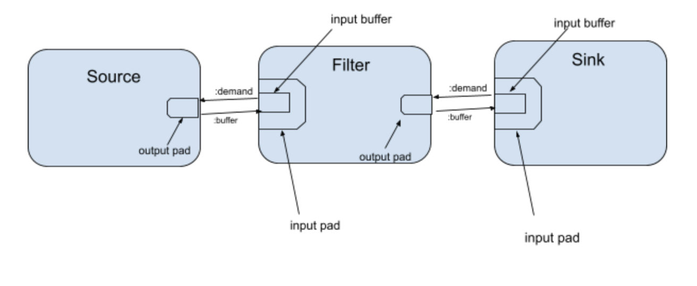

# Data flow in Membrane
Below document contains introduction to buffer and demand flow in membrane framework.

## Introduction
Before diving into the details of the mechanism itself, reader need to understand few things:
  * in this document it is assumed that input pads works in pull mode (this basically means that input buffer is present in the input pad and this input buffer is sending demands)  
  [Hexdocs about available modes](https://hexdocs.pm/membrane_core/Membrane.Pad.html#t:mode_t/0)

  * membrane framework, like other frameworks utilizes <u>inversion of control</u> concept, this basically means that user of membrane framework implements callbacks (user code) and all the low level logic of transporting data from point A to B is handled by <u>membrane core</u>
  * in membrane stream data travels inside buffers  
    [Hexdocs about buffers](https://hexdocs.pm/membrane_core/Membrane.Buffer.html)
  * <b>actions</b> are the basic way for the <b>user code</b> to communicate with the core. Actions are returned from callbacks and they trigger execution of some core logic to handle them. Essential for data flow are:
    * <b>:buffer</b> - causes sending buffers through the specified output pad (`Message.send/4` is called in `ActionHandler.send_buffer/4`)
    * <b> :demand </b> - when handling this action core tries to supply the demand by taking data from the input buffer (`DemandHandler.supply_demand/2`)
    * <b> :redemand </b> - it causes core to invoke `handle_demand` callback on the output pad with unchanged demand

    [Hexdocs about actions](https://hexdocs.pm/membrane_core/Membrane.Element.Action.html) 
  * <b>messages</b> - the basic communication mechanism between elements. The most important for understanding demands and buffer flow are:
    * <b>:buffer</b> - messages of this type carry buffers, after receiving this type of message on the input pad buffers are stored inside the input buffer of the pad
    * <b>:demand</b> -  these messages are usually sent by the input buffer located inside the input pad and they are a way for the consuming element to send demand to the producing element

## Input pad and input buffer
Pad is actually a quite complex structure described by the `Membrane.Pad.Data`
  
[Hexdocs](https://hexdocs.pm/membrane_core/Membrane.Pad.Data.html#content )      
Most important fields form the perspective of this document are:
* <b>demand</b> - current demand requested on the pad
* <b>input_buf</b> - one of the most important structures of the data flow. Input buffer should always have data prepared for the consumption. Its behavior is controlled by two properties: <b>preferred_size</b> and <b>min_demand</b>. Input buffer sends demands to the producing element if amount of stored buffers drops below <b>preferred_size</b>. To avoid flooding the producing element with small demand messages <b>min_demand</b> was introduced.

## Basic data flow

When the pipeline is started, input buffers discover they are empty so they start sending demands. Filters input buffer is sending demands to the source output pad, source is producing buffers which are placed in the filters input buffer. When the filter receives demand from the sink, `handle_demand` callback in the filter is called. In filters this callback is usually implemented in such a way that the `:demand` action is returned. As a result of handling this action buffers are taken from the input buffer and passed to the `handle_process` callback. `handle_process` usually returns `:buffer` action to send processed buffers through the output pad and `:redemand` action to supply any demand left. `:redemand` causes calling handle_demand callback, buffers are taken from the input buffer and passed to the handle process and to on until the demand is supplied. During such processing mostly probably amount of buffers in the input buffer drops below `:preferred_size - :min_demand` so input buffer sends demands to the producing element and so on. But there is a problem...

## Delayed demands
If we look closer we can see that the buffer are processed inside a recurrence call where each buffer can cause another recurrence call (when for example `:redemand` action is returned). Without additional mechanism processing might look as follows:  
Input buffer initial state: [b1, b2, b3, b4, b5, b6]  
		
&nbsp; &nbsp; &nbsp; &nbsp; &nbsp; &nbsp; &nbsp; &nbsp; &nbsp; &nbsp; &nbsp; &nbsp; &nbsp; &nbsp; &nbsp; &#8595;  

Action: demand for 3 elements...  

&nbsp; &nbsp; &nbsp; &nbsp; &nbsp; &nbsp; &nbsp; &nbsp; &nbsp; &nbsp; &nbsp; &nbsp; &nbsp; &nbsp; &nbsp; &#8595;  

Input buffer new state: [b4, b5, b6]   
[b1, b2, b3] &#10142; `handle_process` &#10142; Action :demand for 3 elements returned while processing b1.  

&nbsp; &nbsp; &nbsp; &nbsp; &nbsp; &nbsp; &nbsp; &nbsp; &nbsp; &nbsp; &nbsp; &nbsp; &nbsp; &nbsp; &nbsp; &#8595;  

Input buffer new state: []  
[b4, b5, b6] &#10142; `handle_process` &#10142; No action returned

In above example order of processing buffers would be:  
b1 &#10142; b4  &#10142; b5  &#10142; b6 &#10142; b2  &#10142; b3  
That is obviously incorrect.

To solve this problem a mechanism of <b>delayed demands</b> was introduced. The flag `supplying_demand?` inside the element state determines if the element is currently supplying demand.
*  If the flag is set to `false` the demand is supplied right away when `DemandHandler.supply_demand` is called
*  If the flag is set to `true`, supplying demand and redemands are delayed until the end of current processing. After current processing is done `DemandHandler.handle_delayed_demands` is called to process collected <b>delayed demands</b>.