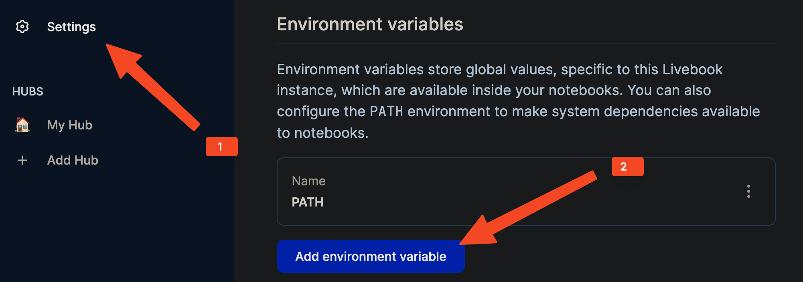

# Livebook examples 

This repository contains examples of using many Membrane modules and libraries.

## Video Compositor and Hackney

This [Livebook](./video_compositor/video_compositor.livemd) shows how to use [Video Compositor](https://hexdocs.pm/membrane_video_compositor_plugin) module to create a video stream from multiple dynamic [Hackney](https://hexdocs.pm/membrane_hackney_plugin) video sources.

## Playing MP3 file 

This [Livebook](./playing_mp3_file/playing_mp3_file.livemd) shows how to use [MP3 decoder](https://hexdocs.pm/membrane_mp3_mad_plugin) and [AAC Encoder](https://hexdocs.pm/membrane_aac_fdk_plugin) to transcode and play audio from an MP3 file.

## Installation

1. Install Livebook

    It is recommended to install Livebook via command line ([see official installation guide](https://github.com/livebook-dev/livebook#escript)). 

    If livebook was installed directly from the official page, one should add `$PATH` variable to the Livebook environment:
    

2. Install modules' native dependencies:
    Install native dependencies based on the `Installation` section in the specified livebook.
    

